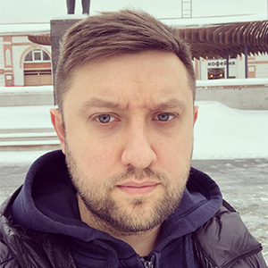

# Ivan Shashkevich
### Junior Frontend Developer

## Contact information:

**Location:**  Moscow\
**e-mail:** shashkev@gmail.com\
**Phone:** +7-926-062-10-08
**Telegram:** @joyvanya
**Discord:** giovanni#4112
[**GitHub**](https://github.com/shashkevich)


## About me

I studied at the Faculty of Economics and graduated from the university in 2010. Since then, I have worked in companies such as Sportmaster, Tervolina, and later became an entrepreneur, which I have been for 8 years. I have a stable income, but my craving for new knowledge, technology and the desire to develop led me to study programming. I already have practice in creating a website in html/css for my company - a small print studio. The next goal is to learn the JavaScript language and become an Frontend Developer. I believe that my current skills and life experience will enable me to succeed.

## Skills

* HTML/CSS/Bootstrap
* JavaScript (basic)
* Git (basic)
* VS Code
* Adobe Photoshop, Illustrator

## Code example

#### Are You Playing Banjo?

Create a function which answers the question "Are you playing banjo?".
If your name starts with the letter "R" or lower case "r", you are playing banjo!

```
function areYouPlayingBanjo(name) {
  if (name[0] == 'r' || name[0] == 'R') {
    return name + " plays banjo"; 
  } else {
    return name + " does not play banjo";
  };  
}
```

## Experience

* Small own business since 2015 - print studuo. I developed website for it using HTML/CSS: https://n1foto.com/ .
* Basic theoretical knowledge of the JavaScript language

## Education

* **Russian State University of Tourism and Service.** Economics, State and Municipal Administration. Specialist Degree (2005-2010)

## English

* **EC Malta.** Business English, Intermediate (2011)\
I have no good practice for a long time, but I try to maintain my level of english.
